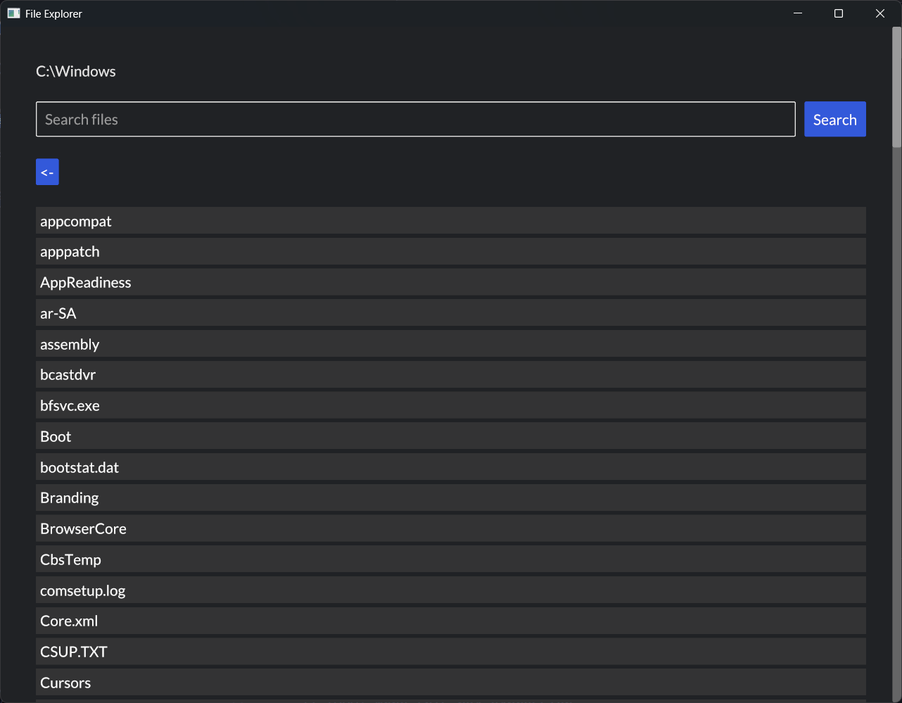

# File Explorer
This is a simple file explorer capable of browsing, opening and searching of files. It is specifically made as an alternative to extremely slow window search. Currently it works only on windows.

## Screenshot


## Technology Used
- Rust
- Iced (for GUI)

## Building from source
To build:
```bash
cargo build
```

To build and run:
```bash
cargo run
```
